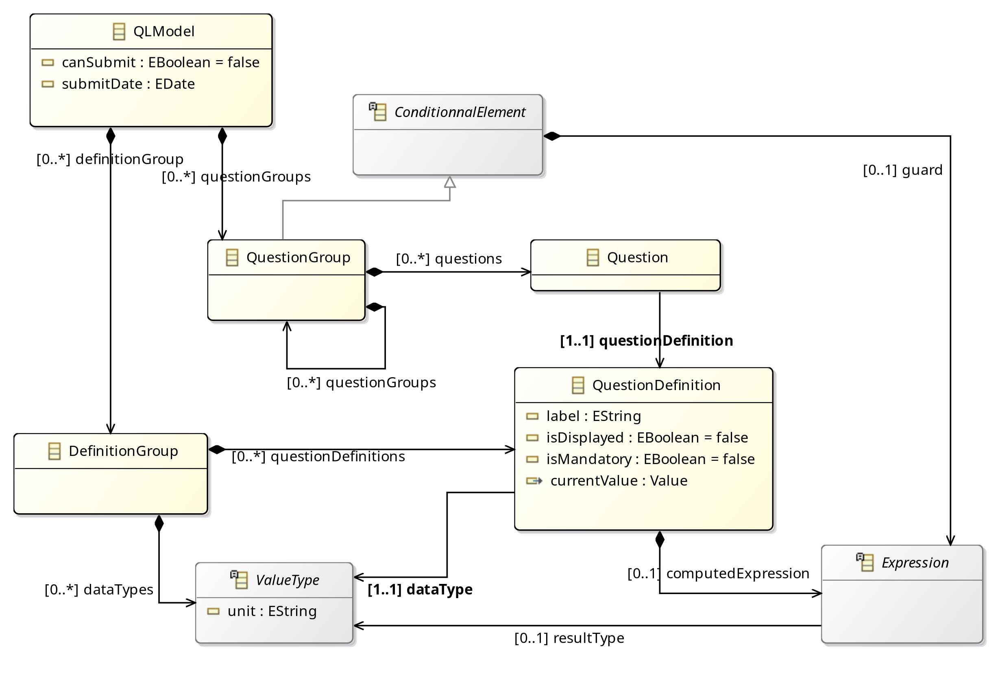
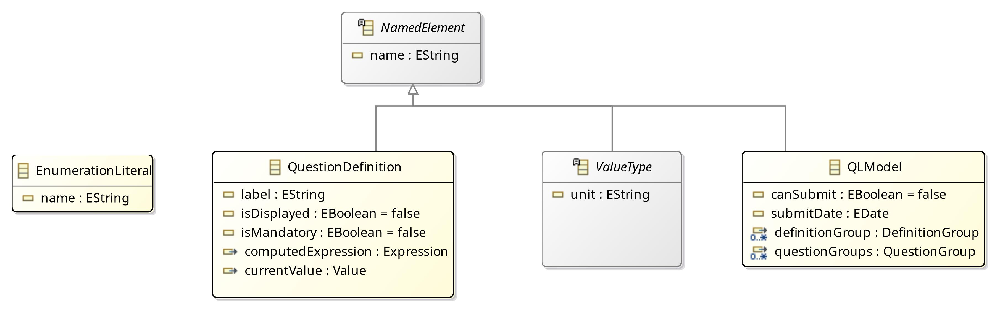
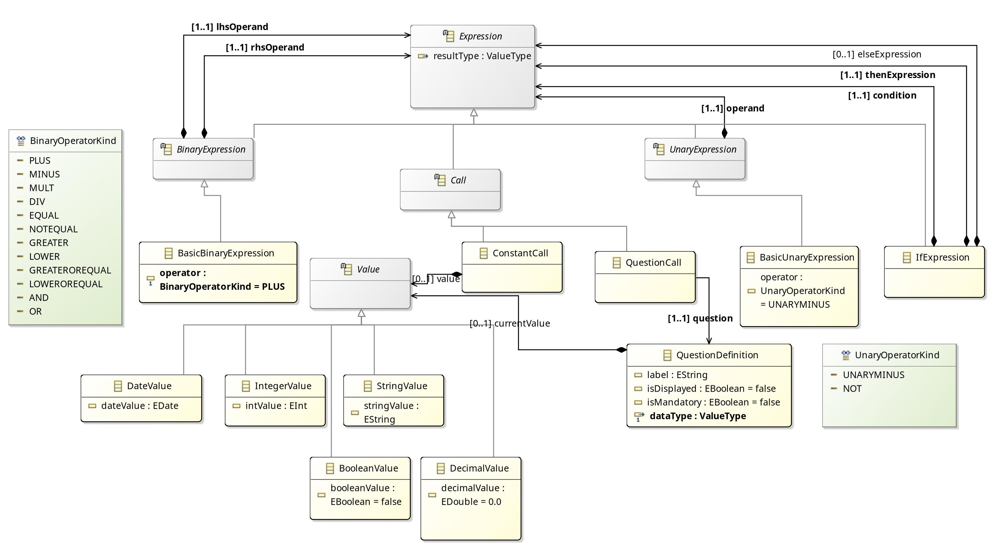

// used to detect if a document is included in readme master
:included_in_readme: true

:imagesdir: docs/img

= ql-gemoc-lwb2025
Questionnaire Language DSL implemented using the GEMOC Studio as a solution for the Language Workbench Challenge 2025 (LWB2025)

:toc:

== Challenge Participation and Context

This document presents the implementation of the "Questionnaire Language" proposed in the https://github.com/judithmichael/lwb25[Language Workbench Challenge 2025]. This challenge, as a continuation of the Language Workbench Contest initiated in 2013, aims to demonstrate the capabilities of modern language workbenches by modeling and implementing a relatively simple but representative domain-specific language (DSL).

The GEMOC Studio integrates and assembles several major existing Eclipse technologies for language engineering, including:

* *EMF* (Eclipse Modeling Framework) for metamodeling and model management,
* *https://eclipse.dev/sirius/[Sirius Desktop]* for the definition of graphical editors,
* *https://www.eclipse.org/Xtext/documentation/[Xtext]* for the specification of textual editors.

Readers may refer to the respective official documentation of these tools for detailed usage information.

Beyond this integration, the GEMOC Studio extends these capabilities by providing:

* Several *semantic modeling frameworks* for defining the execution behavior of models (e.g., K3, ALE for sequential semantics; MoCCML for concurrency modeling),
* *Execution engines* and *engine addons* that enable advanced runtime services such as model animation, debugging, timeline visualization, state space exploration, and concurrency control,
* *Coordination mechanisms* for combining multiple models or languages at execution time.

This architecture allows users to not only define the structure and editors of a DSL but also to specify, execute, and debug its operational semantics.

Given the diversity of capabilities offered by the GEMOC Studio, specific tools and approaches were deliberately chosen to showcase the breadth of GEMOC’s potential. The design decisions made in this implementation aim not only to address the technical requirements of the Questionnaire Language but also to illustrate various features of the GEMOC Studio. In some cases, alternative choices might have been more appropriate for a production-ready language implementation, but demonstrating the versatility of the workbench was prioritized.

The remainder of this document is organized as follows:

* *Quick Start Instructions*: A brief guide to install the necessary tools, import the project, and launch the Questionnaire Language execution. This section allows readers to quickly verify the implementation without going into technical details.

* *Selected Tools, Approaches, and Design Rationale*: A description of the tools and modeling approaches selected within the GEMOC Studio environment, combined with explanations of the main motivations behind these choices.

* *Modeling and Implementation Overview*: A detailed description of the abstract syntax, concrete syntax, and behavioral semantics.

* *Demonstration of Execution and Tooling Support*: An illustration of the execution features enabled by the implementation, including screenshots and explanations of the available tooling.

* *Additional GEMOC Studio features illustrated in other case studies*: Although not directly demonstrated in this implementation, other capabilities of the GEMOC Studio — such as advanced concurrency modeling, state space exploration, live model-execution synchronization, and multi-language coordination — are highlighted through complementary case studies and example languages.

== Repository Structure

The repository is organized as follows:

- `plugins/`
  - Contains the source code for the language definition and execution support.
  - Subfolders:
    - `commons/`: Utility projects reused across different parts of the implementation.
    - `k3ql/`: Projects defining the behavioral semantics of the Questionnaire Language using the K3 framework (GEMOC Sequential Engine).
    - `ql/`: Projects defining the structural (metamodels) and syntactical (editors) aspects of the Questionnaire Language (including Xtext grammar and Sirius diagrams).

[NOTE]
====
Each of these folders contains **multiple Eclipse plug-in projects** that must be imported individually into the GEMOC Studio.
====

- `model_examples/`
  - Example models conforming to the Questionnaire Language.
  - Includes both textual models (`*.ql`) and corresponding graphical representations (`*.aird`).

- `docs/`
  - Documentation files for the project (such as metamodel diagrams and development notes).

- `releng/`
  - Maven/Tycho configuration for building and managing the project as an Eclipse-based product.

- `README.adoc`
  - Entry point documentation, including context, quick start, and technical explanations.

- `.github/`, `.mvn/`, `.settings/`
  - Standard GitHub Actions, Maven, and Eclipse settings for automation and environment configuration.

== Quick start

This section provides the basic instructions to install the *Language Workbench* with the language definitions for the challenge, and to run the *Modeling Workbench* with example models conforming to the languages.

=== Setting up the Language Workbench with Questionnaire Language Definitions

Requirements:

* Java 17 or higher
* A GEMOC Studio downloaded from http://gemoc.irisa.fr/pub/studio/gemoc_studio_2024_11_12/

NOTE: This is the version used to develop the languages for the challenge. A more recent version may be available from https://gemoc.org/download.html.

NOTE: Documentation for the GEMOC Studio is available at https://download.eclipse.org/gemoc/docs/nightly/index.html[here^].

* A `git clone` of the challenge repository: https://github.com/gemoc/ql-gemoc-lwb2025
  (This can also be performed directly from within GEMOC Studio.)

Steps:

* Unzip or untar the downloaded GEMOC Studio.
* Start GEMOC Studio.

NOTE: In this context, we refer to this initial workspace as the *Language Workbench*, since it contains the language definitions for the challenge.

* Import all projects contained in the following folders of the cloned repository:
  - `plugins/commons/`
  - `plugins/k3ql/`
  - `plugins/ql/`

TIP: In GEMOC Studio, use _File_ > _Import..._ > _General_ > _Existing Projects into Workspace_, then select each folder above to import all contained projects at once.

=== Setting up the Modeling Workbench to Use the Questionnaire Language

From the Language Workbench instance of GEMOC Studio, a second instance (the *Modeling Workbench*) must be launched where the developed language plugins will be deployed.

Steps:

* In GEMOC Studio, open the menu: _Run_ > _Run Configurations..._
* Under _Eclipse Application_, select _Launch Runtime Eclipse LWB2025_ and click _Run_.

NOTE: This launch configuration is available if the `org.gemoc.ql.k3ql.xdsml` project has been correctly imported.

[NOTE]
====
Although for demonstration purposes we start the Modeling Workbench from the Language Workbench, it is possible to package the DSL for standalone use by end users. 
See: https://download.eclipse.org/gemoc/docs/releases/3.6.0/userguide-lw-deploy-language.html#distribute-language-for-model-designer-section
====

* In the opened Modeling Workbench, import the projects located in the `model_examples/` folder.

=== Model Editing

* Edit the provided models using the textual editor (`*.ql` files).

.Modeling Workbench textual editor opened on the HouseOwning example
image::mwb_houseOwning_textual_editor.png[Modeling Workbench textual editor opened on the HouseOwning example]

* Visualize models using the graphical editor by opening the corresponding `*.aird` files associated with the `.ql` files.

.Modeling Workbench graphical editor opened on the HouseOwning example
image::mwb_houseOwning_graphical_editor_layers.png[Modeling Workbench graphical editor opened on the HouseOwning example]

[NOTE]
====
For the challenge, we haven't implemented Sirius edition tool (palette) except interactions with the Xtext editor. 
So edition within Sirius views is currently limited to its property view.
====

=== Model Execution

To execute a model (i.e., to start a questionnaire):

* Open the view `QL Form Browser View`:
  - Menu _Window_ > _Show View_ > _Other_ > _Questionnaire Language_ > _QL Form Browser View_.
* Start the model execution:
  - Menu _Run_ > _Run Configurations..._ > _Executable GEMOC with Java engine_.
  - Use one of the predefined launch configurations for the provided models, or create your own (make sure to activate the `QL Form Browser View` addon in the Engine Addons tab).

This launches the questionnaire execution inside the `QL Form Browser View` and, if available, also triggers graphical animation of the model with Sirius.

The Sirius-based graphical animation offers a complementary visualization of the running questionnaire by displaying runtime information directly on the model:
- The current value of each question is dynamically displayed.
- The visual appearance of questions (such as color changes) is updated in real time to reflect their visibility status (e.g., whether a question is currently shown to the user or hidden based on the model's logic).

.Graphical animation of a running questionnaire model in Sirius, showing dynamic updates of question values and visibility states during execution
image::mwb_projectBudget_run.png[Graphical animation of a running questionnaire model in Sirius, showing dynamic updates of question values and visibility states during execution]

=== Model Debugging

To debug a model (i.e., to start a questionnaire in debug mode):

* Open the Debug perspective:
  - Menu _Window_ > _Perspective_ > _Open Perspective_ > _Debug_.
* Open the view `QL Form Browser View` as described above.
* Start the model in debug mode:
  - Menu _Debug_ > _Debug Configurations..._ > _Executable GEMOC with Java engine_.
  - Use one of the predefined launch configurations or create your own.

In addition to the Sirius-based graphical animation available during execution, several debugging-specific views and actions are provided. These features operate at the level of the *Questionnaire Language* (i.e., they allow debugging the model itself, not the underlying Java code):

- **Stack View**: Displays the current execution stack when the execution is paused.
- **Variables View**: Shows the current runtime values of the model elements.
- **Step-by-Step Execution**: Enables manual control to execute one step at a time through the model behavior.
- **Model Breakpoints**: Allows breakpoints to be set directly on model elements (Right-click a model element in the Sirius view to toggle a breakpoint; execution will pause when a related model step occurs).
- **Current Element Highlighting**: Highlights the model element currently being executed (decorated in yellow in the Sirius graphical editor and selected in the textual Xtext editor).
- **Multidimensional Timeline (optional)**: If enabled in the launch configuration (Engine Addons tab), the *Multidimensional Timeline* view visualizes the history of runtime data changes over time in a structured and synchronized manner.

These capabilities together offer a rich environment for observing, inspecting, and controlling the execution of the questionnaire models at a high level of abstraction.

.Modeling Workbench with the HouseOwning example pause after a click on hasSoldHouse and while rendering the questions (only 2 out of the 3 optional questions have been enabled and displayed at this point)
image::mwb_houseOwning_debug_paused_when_updating_value_from_ui_hasSoldHouse.png[Modeling Workbench with the HouseOwning example pause after a click on hasSoldHouse and while rendering the questions (only 2 out of the 3 optional questions have been enabled and displayed at this point)]

== Selected Tools, Approaches, and Design Rationale

For this implementation, we selected a combination of GEMOC Studio tools and modeling approaches to illustrate both essential and advanced capabilities of the platform. The choices were guided by a balance between simplicity, modularity, and demonstration value for the challenge.

=== DSL Edition

* **EMF (Eclipse Modeling Framework)** was used to define the metamodel, and automatically provide a basic *tree-based editor* for model instances (offering a structured syntax).
* **Xtext** was employed to define a more user-friendly *textual syntax* for questionnaire models, integrated directly into the Eclipse environment.
* **Sirius Desktop** was used to define *graphical visualizations*:
  - A *Basic Object Diagram* was automatically generated using the GEMOC wizard. Inspired by UML Object Diagrams, this view is verbose and generic, but can serve as a starting point for more specialized diagrams.
  - A manually crafted *QLDiagram* was designed to offer a more domain-specific and readable visualization of questionnaires.

[NOTE]
====
In this implementation, the Sirius graphical editors focus on visualization rather than full model editing: edition actions (e.g., palette tools) were not implemented, and editing remains limited to the property view or synchronized editing through the Xtext textual editor.
====

=== DSL Semantics

* A **K3-based sequential execution engine** defines the operational semantics of the questionnaire models. https://www.kermeta.org/[K3 language] offers a simple yet powerful metaprogramming approach by weaving behavioral aspects directly onto EMF model elements.

NOTE: As K3 language is actually a set of annotations for the https://eclipse.dev/Xtext/xtend/[Xtend] that compiles to java, for GEMOC this is also refered as GEMOC Java Engine.

* **Separation of UI and execution semantics** was emphasized through the use of the GEMOC Engine Addon mechanism:
  - A custom Engine Addon (`QLFormBrowserView`) was developed to handle the display and interaction of the questionnaire UI, without mixing UI concerns into the execution semantics.
  - This addon listens to runtime events published by the execution engine, enabling dynamic updates of a web-based form embedded in an Eclipse view.

[IMPORTANT]
====
The https://download.eclipse.org/gemoc/docs/nightly/_contributing.html#dev-new-addonsEngine Addon mechanism used here reflects one of GEMOC Studio’s core strengths: it enables coordination between multiple concurrent runtime models or external systems. In this case, the questionnaire execution and the UI form are treated as loosely coupled artifacts, coordinated dynamically through the engine events.
====

=== Edition and Semantic Customizations

* **Debug layers** were automatically generated for both Sirius diagrams, providing support for execution highlighting, breakpoints, and stepping during model debugging.
* **Animation layers** were manually designed for the *QLDiagram*, enabling visual feedback during execution (such as dynamic value display and question visibility indication).

=== Resulting Language

The resulting language and its associated tooling support are named **K3QL**.  
*K3QL* encapsulates the questionnaire domain-specific modeling constructs, textual and graphical editors, execution semantics, and runtime interaction features defined through the approaches outlined above.

== Modeling and Implementation Overview

//A detailed description of the abstract syntax, concrete syntax, and behavioral semantics.

=== Abstract Syntax

The abstract syntax of the QL language is capture using an Ecore metamodel that is defined in the `org.gemoc.ql.model` plugin.

It is organized as follow:

.QL main class diagram
[#img-ql-main-class-diagram]
[caption="Figure 1: ",link=https://github.com/gemoc/ql-gemoc-lwb2025/blob/main/plugins/ql/org.gemoc.ql.model/model/img/ql main class diagram.jpg]

.Named elements class diagram
[#img-named-elements-class-diagram]
[caption="Figure 1: ",link=https://github.com/gemoc/ql-gemoc-lwb2025/blob/main/plugins/ql/org.gemoc.ql.model/model/img/ql named elements class diagram.jpg]

.Expression class diagram
[#img-expression-class-diagram]
[caption="Figure 1: ",link=https://github.com/gemoc/ql-gemoc-lwb2025/blob/main/plugins/ql/org.gemoc.ql.model/model/img/ql expression class diagram.jpg]

.Types class diagram
[#img-types-class-diagram]
[caption="Figure 1: ",link=https://github.com/gemoc/ql-gemoc-lwb2025/blob/main/plugins/ql/org.gemoc.ql.model/model/img/ql type class diagram.jpg]

<> shows that `Question` conforms to  a `QuestionDefinition`. A set of `Question` is organized in group and sub-group that may have a guard. This guard indicates when the questions in the group must be displayed.
`QuestionDefinition` may be calculated by evaluating an `Expression`.

NOTE: The name `Question` and `QuestionDefinition` is arguable in case of calculation. A refactoring may be done later in order to enhance the readability of the abstract syntax.

A `QuestionDefinition` data is typed  by a `ValueType` that can take one of the primitive type as shown in <>.

`ValueType` are defined with the Questionnaire (QLModel) and may define a `unit` and additional attributes such as min or max. 

`Expression` allows to support evaluation of `Value` that can come from different kind of expression: `BinaryExpression` for expression having left hand side and right hand side, `UnaryExpression` for operators such as `Not` or `Minus`.

the `IfExpression` allows to create conditional expression return the evaluation of the `thenExpression` or the `elseExpression` depending on the evaluation of the `condition`.

The runtime data has been directly added into the QL.ecore: `QuestionDefinition.currentValue`, `QuestionDefinition.isDisplayed`, and `QLModel.canSubmit`. These data aren't intended to be directly edited by the user but used by the interpreter. They have the annotation `aspect` in order to identify them in the ecore file.

[NOTE]
====
Some techniques exist to define these runtime data separately from the QL.ecore:

* by weaving ecore models using http://melange.inria.fr[Melange] but this would have made the projects more complex due to the required conversion. (see. https://download.eclipse.org/gemoc/docs/nightly/userguide-lw-create-language-define-syntaxes.html#section-melange-editor and http://melange.inria.fr)

* by creating a separate metamodel that references the elements in QL.ecore, as a counter part, the code for the behavior would have been a bit less readable.
====

=== Concrete Syntax

Three editors are provided: the EMF tree editor, the XText textual editor, and the Sirius graphical editor

==== EMF tree editor
It was not modified much from its initial generation except for some minor enhancement  about the model element labels and icons.

It is composed of the plugins: `org.gemoc.ql.model.edit` and `org.gemoc.ql.model.editor`

TIP: `org.gemoc.ql.model.edit` is actually reused in several other editors and Eclipse views, such as the Sirius editor and the outline view.

==== XText textual editor

It is composed of the plugins: `org.gemoc.ql.xtext`, `org.gemoc.ql.xtext.ide`, and `org.gemoc.ql.xtext.ui`.

The `QL.xtext` file defines a user friendly grammar allowing support of qualified names, expressions, ...

It provides a modern textual editor with syntax coloring, code completion, error reporting, ...

It also provides a framework for quick fixes, validation, renaming, hovering, ...  A more complete list of feature is available in this https://eclipse.dev/Xtext/documentation/310_eclipse_support.html[XText documentation section].

For the challenge, in addition to the grammar, we also have slightly customized the formatting support.

==== Sirius Graphical editor

It is composed of the plugin: `org.gemoc.ql.design`.

It provides 2 diagrams:
* A *Basic Object Diagram* was automatically generated using the GEMOC wizard. Inspired by UML Object Diagrams, this view is verbose and generic, but can serve as a starting point for more specialized diagrams.
* A manually crafted *QLDiagram* was designed to offer a more domain-specific and readable visualization of questionnaires.

Sirius provides a way to define a mapping between visual elements (Node, Edge) and the abstract syntax concepts. Then it interpret this mapping in order to provide
  
Each diagram use the notion of _Layer_ in order to easily switch on or off  some customization.

For example the QLDiagram, proposes a `Typing` layer tha shows the link between `Question` and `QuestionDefinition`

The `Debug` layer has been generated by GEMOC. It allows to set/remove breakpoints, and allow to conditional styling during debug pause (ie. highlight the element in the diagram corresponding to selection in the stack view)

TIP: Sirius provides several kind of representations. In the challenge, we used the Diagram representation, but other might be useful too see https://eclipse.dev/sirius/doc/specifier/Sirius%20Specifier%20Manual.html[Sirius Specifier Manual]

=== Behavioral Semantics

==== Core Execution Semantics

The execution semantic is defined in the `org.gemoc.ql.k3ql.k3dsa` plugins.

The operational semantics of QL are defined in the files `qlAspects.xtend`. This file which employs http://www.kermeta.org/[Kermeta 3 (K3)] and the https://en.wikipedia.org/wiki/Interpreter_pattern[Interpreter Design Pattern] to describe the dynamic behavior of QL models.
Its contents is woven into the metamodel of your executable DSL. In this file, you have aspects for all classes of your metamodel. Some of these aspects use annotations to define execution functions or entry points.

*Execution Functions*:

The Execution Functions define how the Execution Data evolve during the execution of the model. Execution Functions can be implemented by defining the body of a method. These methods must be annotated with the *@Step* annotation. Whenever a method with an `@Step` annotation returns, the changes in the model will be applied (via a transaction) to the resource. This means that the changes will be visible from an animator. K3 supports nested `@Step` annotation calls so that changes in the model will be applied when entering and leaving methods having these annotations.

*Entry Points*:

The GEMOC sequential engines uses methods annotated with *@Main* as entry points to model execution. This annotation must be placed on operations applicable to model elements considered as the model starting point. 

Additionally, a function annotated with *@InitializeModel* will be used to capture any argument passed by the launcher in order to initialize the runtime data if necessary.

For the challenge, the entry point is a `QLModel` element.

The logic in QL implementation is as follow:

* The main method is simply a loop that alternates question rendering requests, wait for user input, computation of value for computed questions.
* When the submit button has been pushed, it ends by performing a basic serialization of the whole model, including the runtime data (ie. the answers)

Question rendering requests ensures via guard evaluation that only `Question` in group where the guard is true will be rendered.

The concrete rendering in the UI is handled by an engine addon that captures the events `Question.show()` and the event `QLModel.updateSubmitButtonStatus()`.
Similarly, the wait for user input is also handled by the engine addon that captures the event `QLModel.waitUserInput()`. It pauses the execution until the UI has some event.
The events `QLModel.readSubmitButtonStatus()` and  `QuestionDefinition.updateCurrentValueFromUI()` are also captured by the addon. They modify the runtime data in the model.

==== UI 

TODO: Separation of the UI/ADddon 

== Demonstration of Execution and Tooling Support
// An illustration of the execution features enabled by the implementation, including screenshots and explanations of the available tooling.

== Additional GEMOC Studio features illustrated in other case studies

Although not directly demonstrated in this implementation, other capabilities of the GEMOC Studio — such as advanced concurrency modeling, state space exploration, live model-execution synchronization, and multi-language coordination — are highlighted through complementary case studies and example languages.

== Details of the development status

include::docs/dev_status.adoc[]

image:https://github.com/gemoc/ql-gemoc-lwb2025/actions/workflows/maven.yml/badge.svg[Java CI with Maven, link="https://github.com/gemoc/ql-gemoc-lwb2025/actions/workflows/maven.yml"]
